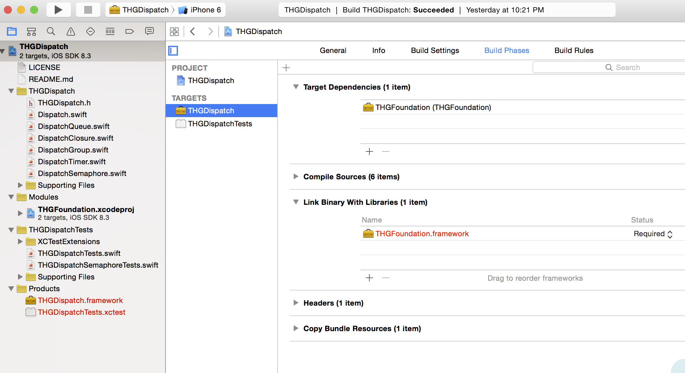
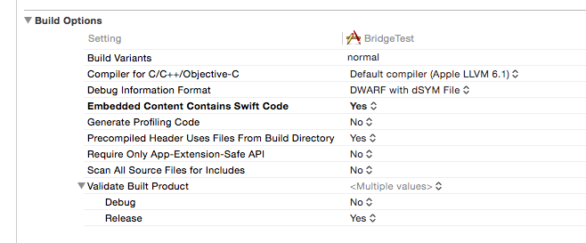

# Dennis
Guides on contributing, Language Style Guide, Best Practices and Recommendations, and very very much a work in progress.

---

```
DENNIS:  You're fooling yourself.  We're living in a dictatorship.
         A self-perpetuating autocracy in which the working classes--
         
WOMAN:  Oh there you go, bringing class into it again.
```
---

## Contributions

The following critiera will be used to accept contributions:

* Does the contribution solve a problem?
* Does it correct an issue in the software?
* Was it contributed to the most relevant project?
* Does it adhere to this guide (as it exists at the time of the contribution)?
* Does the contribution contain unit or functional tests?
* Does it break existing code or mitigate that breakage somehow?
* ... more to follow
 
The above being said, we want to help you meet the criteria that we've set out if your contribution doesn't already.  We'll do that through PRs, issues, carrier pidgeons, etc.

## New Projects

### Naming

New projects must have a "Monty Python and The Holy Grail" related name (whether that's a character, a place, something one might've found in said time period, whatever, it's pretty loose), in addition to a meaningful name.

Example: Soothsayer (movie reference) and THGReachability (meaningful name).  The idea being along the lines of...
```
GALAHAD: Tell me soothsayer, what say you about network connectivity?
SOOTHSAYER: What connectivity?
```

The meaningful name is important as well.  Can you imagine doing this...

```Swift
import Foundation
import Soothsayer // What the hell does this do???
```

whereas...

```Swift
import Foundation
import THGReachability
```

Ah yes.  I can get an idea of what THGReachability is.

### Prefixes

Prefix only the module name, not the classes within the module.

```
RANDOM PEASANT:  Ye ole Swift guide said you don't need prefixes!
GOD:  There's 4 Swift Reachability implementations by 4 different authors that are all have the 
      same module name, 'Reachability'.  It's like those miserable Psalms-- they're so depressing.
GOD:  So, just prefix the module name.
ARTHUR: A blessing!
LAUNCELOT:  A blessing from the Lord!
GALAHAD:  God be praised!
```
So... we will prefix our module names with THG to avoid this confusion and potential collision.  The contained enums/classes/structs shall not contain any prefixes.

Example:

THGReachability <- Module name.<br>
Reachability <- Class inside of module.<br>

### Directory Structure


As you can see above, the top level directory is the "funny" name (KillerRabbit), and everything under it references the meaningful name (THGDispatch).  The easiest way to accomplish this is to start a new project in Xcode, and when asked for the name, enter your meaningful name.  Once you've done that, close the project.  Go to finder, and then rename the top-level directory that Xcode created to the "funny" name.

### Project Structure


We want to fight with Xcode as little as possible.  What you see above is more or less the stock layout that Xcode sets up.  In more source-file heavy projects, you should try to split things up logically and use matching groups and subdirectories.  I have also added a group called "Modules" where I'll keep my dependencies.  More on that later.

### Dependencies

#### Module/Framework?  App?

If you're building a Module or Framework, you should set your project up such that any dependencies are side-by-side in the file system.

Example:


KillerRabbit depends on Excalibur.  Both are Modules.

Keep in mind, that in this example, the "Modules" group doesn't have a subdirectory backing it.  This is intentional and the default way that Xcode works.  Dependencies should only be added as .xcodeproj files added into the project.  You'll need to configure the dependencies manually inside your Xcode project, like so.



#### Objective-C Project Setup
To get this working in an Objective-C project - 

Configure the dependencies as an  embedded binary 


Set Embedded Content Contains Swift Code in Build Settings




